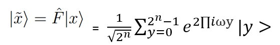

# QFT in classical python with encoded qubit states:

 The QFT relies on the encoding of qubit states into the rotational gate of the equation. 

The encoding is often represented using binary notation so that:

 and ω  = 0.x1x2x3… is simply a notation.

The conversion to binary and computation in decimal was confusing and it took a few days for me to figure out, but it is helpful to think of each bit of the qubit or the x state as a coordinate on the Cartesian plane.

The superposition of each state of x­­­ or xy must be encoded as so that:

 
The QFT on 2 qubits therefore produces 4 states which when encoded into the exponent of **Ψ** will result in 4 ¼ rotations on the Bloch sphere.

I wrote the code based on the qubit states encoding algorithm where:

When x is encoded into the exponent of the coefficients rotation this gives the probable location within in psi. 

With 4 qubit states we take 1/4 steps rotation and each state corresponding as:

|00> = 0
|10> = 0.25
|01>= 0.50
|11> = 0.75

Work in progress:
I need to build an iterative loop for the reverse and swap gates allowing the program to go beyond 2 quits. While this is something that generally can easily be done, the w[i] is interpreted as a function and not a complex value, therefore I need to convert to float or integer in a way that maintains the algorithm for working with any number of qubits.

**References:**

Anagolum, S. (2018, October 11). _Arithmetic on Quantum Computers: Addition, Faster._ Retrieved from https://medium.com: https://medium.com/@sashwat.anagolum/qftaddition-ce0a0b2bc4f4

courses.edx.org. (2020, August). _QFT, Period Finding & Shor’s Algorithm_. Retrieved from courses.edx.org: https://courses.edx.org/c4x/BerkeleyX/CS191x/asset/chap5.pdf

Dehestani, Maryam *; Shojaei, Somaie; Quím, Azita Khosravan. Nova vol.35 no.9 São Paulo 2012: https://www.scielo.br/scielo.php?script=sci_arttext&pid=S0100-40422012000900018#tab04

Dubey, A. (2018, December 27). _Fourier Transformation and Its Mathematics._ Retrieved from https://towardsdatascience.com/: https://towardsdatascience.com/fourier-transformation-and-its-mathematics-fff54a6f6659

Hui, J. (2018, November 20). _QC — The strength and the weakness of Qubits in Quantum Computing_. Retrieved from medium.com: https://medium.com/@jonathan_hui/qc-the-strength-and-the-weakness-of-qubits-in-quantum-computing-dc54c442fcb3

Philip Kaya, R. L. (2007). _An Introduction to Quantum Computing ._ New York : Oxford University Press.

Thomas, R. (2016, May 26). _Trudeau, Shor and a lot of qubits._ Retrieved from secvibe.com: https://secvibe.com/trudeau-shor-and-lot-of-qubits-f5e5bd093942

Young, P. (2019, November 2). _The Quantum Fourier Transform and a Comparison with the Fast Fourier._ Retrieved from young.physics.ucsc.edu: https://young.physics.ucsc.edu/150/QFT-FFT.pdf